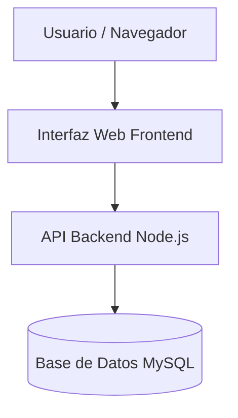

# Sistema de Biblioteca Virtual


Aplicacion web para la gestion y prestamo de libros digitales en linea.
Permite a los usuarios buscar catalogos, reservar libros y gestionar sus devoluciones de forma sencilla.

## Tabla de contenidos

- [Descripcion](#descripcion)
- [Instalacion](#instalacion)
- [Uso](#uso)
- [Estado de funcionalidades](#estado-de-funcionalidades)
- [Pendientes](#pendientes)
- [Arquitectura](#arquitectura)
- [Contribuidores](#contribuidores)

## Descripcion

El Sistema de Biblioteca Virtual es una plataforma desarrollada para digitalizar la busqueda y prestamo de libros. 
Su objetivo es facilitar el acceso al catalogo desde cualquier dispositivo.

## Instalacion

Ejecuta los siguientes comandos en la terminal para clonar e instalar el proyecto:

```bash
git clone [https://github.com/henrymendoza-240/laboratorio-readme.git](https://github.com/henrymendoza-240/laboratorio-readme.git)
cd laboratorio-readme
npm install
```
Uso
Para iniciar el servidor de desarrollo local:

``` Bash
npm start
```
# Estado de funcionalidades

| Modulo | Funcionalidad | Estado | 
|---|---|---|
Autenticacion | Registro y Login de usuarios | Listo
Catalogo | Busqueda de libros por autor o titulo | Listo
Prestamos | Reserva y devolucion de libros | En progreso
Reportes | Historial de prestamos del usuario | Pendiente

## Pendientes

- [x] Crear el esquema de la base de datos

- [x] Configurar la API REST inicial

- [ ] Implementar la pasarela para multas de devolucion

- [ ] Realizar pruebas unitarias e integracion

## Arquitectura


## Contribuidores
- Henry Mendoza